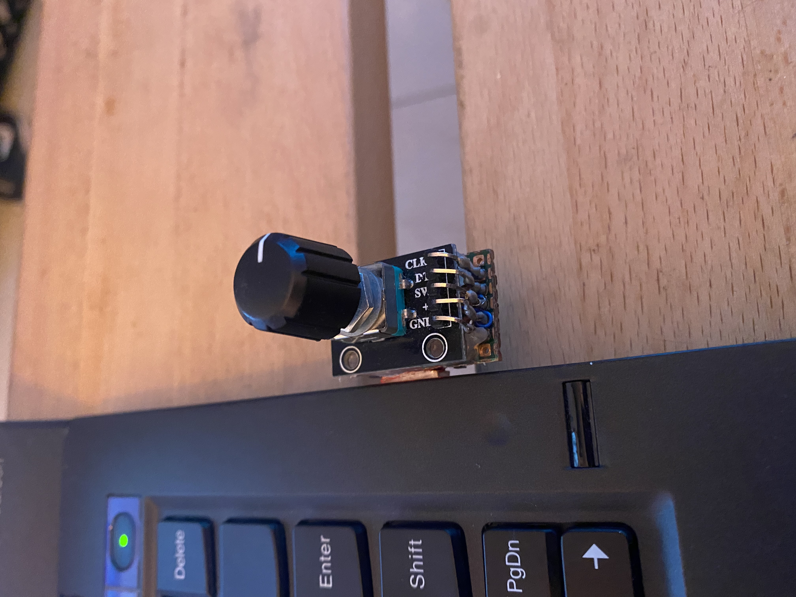
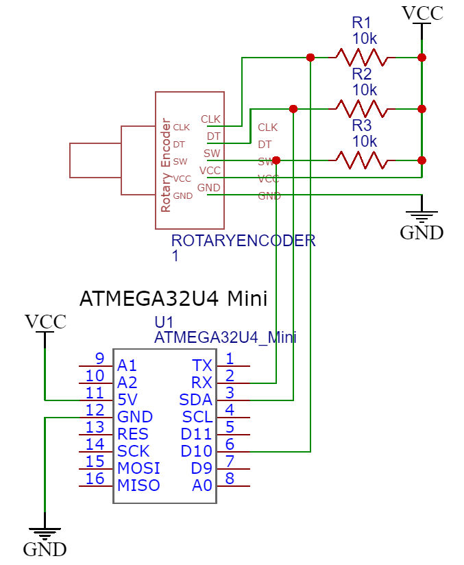

# Arduino tab/window scroller

This project is a nice add-on to your workstation/laptop, this will add a physical rotary encoder that will allow you to control your open windows/tabs with a simple rotation of the knob.
Rotating the knob of the rotary encoder will scroll through open tabs of any program which supports it such as a browser, notepad, IDE etc.
At the push of the built in button you will switch modes to scrolling through windows instead of tabs.
The expected target audience for this project is any microcontroller hobbyist who wants to upgrade his workstation.

### Main features of the project

- Uses a rotary encoder to detect user switches and sending keystrokes to the computer.
- Sends keystrokes to the computer using a single library (Keyboard.h).
- Pressing the button will change its mode to scrolling windows instead of tabs.
- With a simple change of the code you will be able to change the keystrokes sent to the computer and control other features like changing the computers volume.

### Components required

1. 1 Arduino mini (or any other microcontroller based on the ATmega32U4)
2. 1 Rotary encoder with a built in push button
3. 3 10k Ohm resistors as a pull up resistors

Notice: It is important that your Arduino will be based on the ATmega32U4 since most microcontrollers don't support sending keystrokes as a keyboard to the PC.

### Schematic diagram

                           
To supply power to the circuit you can use the Arduino USB connector or the Power supply connector (on Arduino Uno).

### Description of the system

The Arduino board (ATmega32U4) detects a change in the rotary encoder and checks to see to which position the encoder was rotated.

It then sends the keystrokes CTRL + Tab (or CTRL + Shift + Tab, depends on the rotation direction) to the computer for a single rotation which will move to the next/previous tab accordingly.

When pressing the push button the Arduino will change its mode to scrolling through open windows for every encoder rotation.

When in windows scrolling mode the Arduino send the keystrokes Alt + Tab/Alt + Shift + Tab.

## Code

Code is available [here](Code/Main.ino)

### Watch this project in action

Examine this demo video

 
